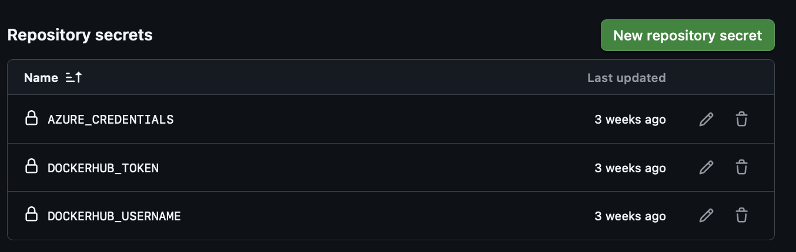
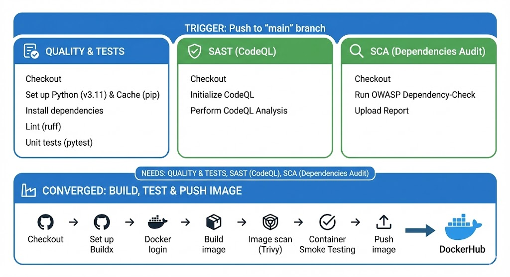

# shortURL — URL Shortener

A production-ready URL shortener built with **Python**, **FastAPI**, **Jinja2 templates**, and **SQLite**.

The project focuses on simplicity, clean architecture, and zero heavy frontend frameworks while still providing a modern UI and robust backend features.


### Core Functionality
- Shorten long URLs with random or custom aliases
- Redirect using short codes (302 redirects)
- Track click counts and analytics
- Optional user authentication
- Anonymous URL shortening supported

## Quick Start (Local)

```bash
# Clone the repository
git clone <repo-url>
cd shortURL

# Create virtual environment
python -m venv venv
source venv/bin/activate

# Install dependencies
pip install -r src/requirements.txt

# Create env file
cp .env.example .env.local

# Run the application
uvicorn src.main:app --reload
```

The application will be available at:
    ```
    http://localhost:8001
    ```

## Secrets Configuration


## CI - Diagram
